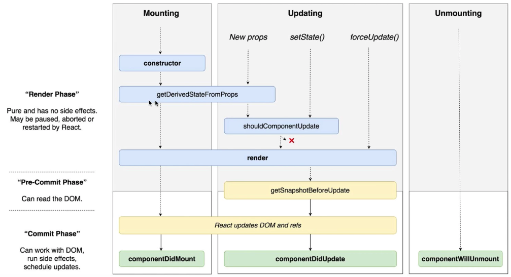

# React LifeCycle API



<br />
<hr />

### constructor
```js
constructor(props) {
    super(props);
    console.log('constructor');
}
```

<br />

* 컴포넌트가 새로 만들어질때 생성

<br />
<hr />

### getDerivedStateFromProps
```js
static getDerivedStateFromProps(nextProps, prevState) {
    if(prevState.value !== nextProps.value) {
        return { value: nextProps.value };
    }
    return null;
}
```

<br />

* 현재 값과 다음 값을 비교하여 같은면 null 아니면 다음으로 받아올 값으로 변경한다.
* props 값을 state 와 동기화 시킬때
* nextProps : 다음으로 받아올 프롭스 값
* prevState : 현재 업데이트 되기전의 상태를 가져온다

<br />
<hr />

### shouldComponentUpdate
```js
shouldComponentUpdate(nextProps, nextState) {
    if(nextProps.value === 10) return false;
    return true;
}
```

<br />

* 컴포넌트가 업데이트를 할지 말지 정해주고
* false 일경우는 렌더링을 안하고
* true 일경우 렌더링을 한다.

<br />
<hr />

### getSnapshotBeforeUpdate
```js
getSnapshotBeforeUpdate(prevProps, prevState) {
    console.log('getSnapshotBeforeUpdate')
}
```

<br />

* DOM 변화하기 직전의 상태를 가져오며
* 여기서 리턴하는 값은 `componentDidUpdate`에 3번째 파라미터로 받아올수있다.
* 대게 `prevProps`와 `this.sate`값을 비교하여 이벤트를 발생시킨다.

<br />
<hr />

### componentDidUpdate
```js
componentDidUpdate(prevProps, prevState, snapshot) {
    if(this.props.value !== prevProps.value) {
        console.log('componentDidUpdate', this.props.value);
    }
}
```

<br />

* render()를 호출하고난 다음에 발생한다.

<br />
<hr />

### componentWillUnmount
```js
componentWillUnmount() {
    console.log('componentWillUnmount')
}
```

<br />

* 컴포넌트가 더 이상 필요하지않을시 사용
* 이벤트, setTimeout, 외부 라이브러리 인스턴스 제거

<br />
<hr />

### componentDidCatch
```js
componentDidCatch(error, info) {
    this.setState({ error: true });

    // API를 통해서 서버로 오류 내용 날리기
    console.log(error);
    console.log(info);
}
```

<br />

* 컴포넌트 자신의 render 함수에서 에러가 발생해버리는것은 잡아낼 수는 없지만,
* 그 대신에 컴포넌트의 자식 컴포넌트 내부에서 발생하는 에러들을 잡아낼 수 있습니다.
* 그러므로 에러가 발생하는 컴포넌트가 아닌 부모 컴포넌트에서 실행
* 실수로 잡지 못했던 잡기위해 에러는 트레킹으로 넘기고 클라이언트에서는 메세지를 출력한다.

> 출처
> [LifeCycle API](https://react-anyone.vlpt.us/05.html)
